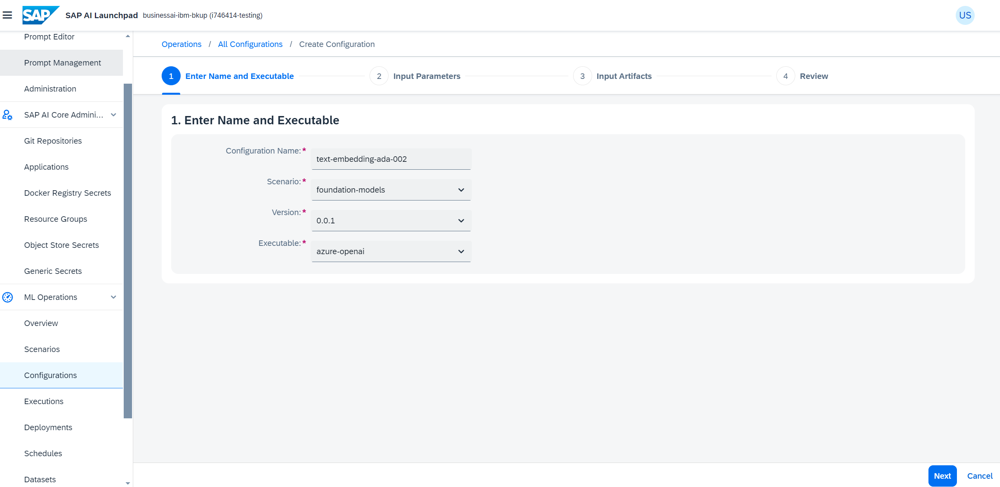
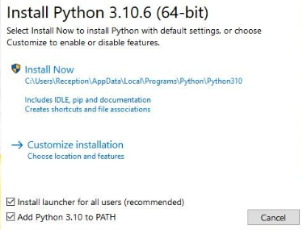
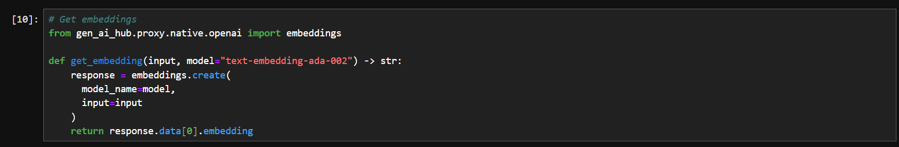
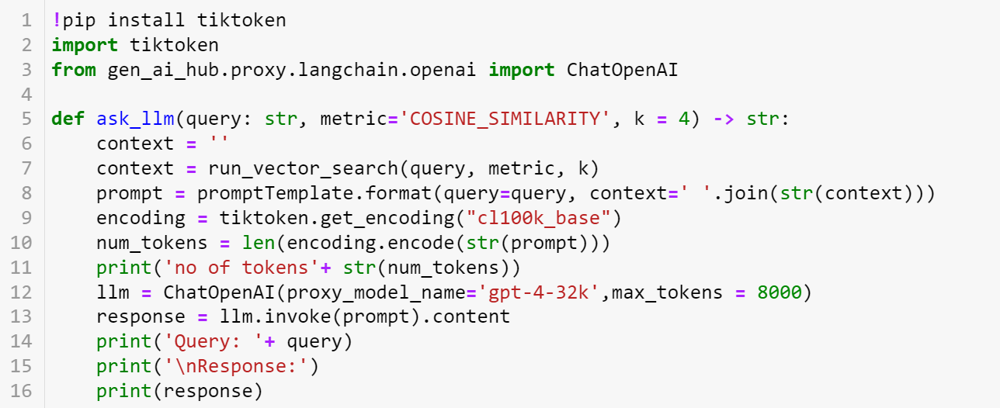

# Business AI week

In this workshop we are going to try out a RAG scenario where we will deploy an app that accepts a PDF via API from user and stores it to a Hana DB as embedings and answers the querries asked by the user.

## Pre-requisite
- Access to AI core and lauchpad with SAP Extended Plan
- Hana DB with Vector store enabled
- CF
- Users should be mapped to their own CF spaces with space developer role
- HANA Cloud instance should be mapped to all CF spaces
- HANA credentials(individual users for each training user), AI Core credentials and Reddit credentials needs to be given to users during training

## Utilizing RAG Embeddings for Enhanced Developer Support

Bob is a Content  developer in the XYZ company. His team works on a node library that can simplify the software development process inside and outside the company. His team has designed a dedicated documentation for the library. But the developers who use the library always face issues and contact Bob. To make his job easy, Bob decided to use Generative AI for this Use case. 

Bob uses the Generative AI Hub SDK to create a help portal for his library. He wants to Improve the effectiveness of our help portal by integrating RAG (Retrieval-Augmented Generation) embeddings so that Developers can receive more contextually relevant responses to their queries about the node library. 

Acceptance criteria: 

- Bob utilizes the Generative AI Hub SDK to integrate a generative AI model into the help portal for the company's node library. 

- Bob configures and deploys the generative AI model within the AI core instance of the company's infrastructure. 

- The help portal powered by Generative AI should provide intuitive and contextually relevant responses to developers' inquiries about using the node library. 

- The generative AI model is trained on the documentation of the node library to ensure accurate and informative responses. 

- The help portal interface is user-friendly, allowing developers to easily interact with the generative AI model and find answers to their questions. 

- Bob monitors the performance of the generative AI model regularly, ensuring that it continues to provide accurate and helpful responses to developers' queries. 

- Bob documents the process of integrating the Generative AI Help Portal into the company's support workflow, providing clear instructions for future maintenance and updates. 

- Bob Queries the model 

- Implements RAG embeddings 

- Enhances Query responses 

- Bob conducts training sessions or provides documentation to the support team, educating them on how to leverage the Generative AI Help Portal effectively to assist developers. 

### Setting up LLM's on AI core

- Bob navigates to ML Operations -> Scenarios in the AI-Core workspace. 

- He ensures that the foundation-models scenario is present. 

- Bob goes to ML Operations -> Configurations and creates a new configuration: 

- Names it appropriately. 

- Selects the foundation-models scenario. 

- Chooses the version and executable ID. 

- He sets input parameters specifying the model name and version. 

- Bob reviews and creates the configuration. 

Model Deployment: 

- Bob creates a deployment for the configured model, setting the duration to standard. 

- After the deployment status changes to RUNNING, he verifies its availability. 

Model Integration: 

- Bob installs the Generative AI Hub SDK by running pip3 install generative-ai-hub-sdk. 

- He configures the SDK using AI core keys stored in the local directory. 

- Bob installs Jupyter Notebook using pip3 install notebook. 

- He opens a Jupyter Notebook instance using the command python3 -m notebook. 

Please use the AI Launchpad link given in the system landscape file. Please use the username assigned to you (e.g. sysops-generic-userXX@sap.com)

In your SAP AI Launchpad instance, create your own resource-group. Go to SAP AI Core Administration -> Resource Groups, and click on Create.


Give the name of the resource group same as your username for your launchpad. Do not create the resource group with the name default. In the screensots below, we have used the default resource-group, but for the exercise, you have to use your own resource group.


Now go to your resource group by clicking on Workspaces -> your_resource_group.

If it is not visible, refresh your browser to see your resource group.

Go to ML Operations -> Scenarios. Check whether the foundation-models scenario is present in your AI-Core workspace.


Go to ML Operations -> Configurations. Click on the Create button


Give a name for the configuration.
Select the foundation-models scenario.
Choose the version.
Choose the Executable ID.


In input parameters, give name and version of the model you want to use.


Here, create a configuration for the text-embedding-ada-002 model.



These are the models available as of now:


Click on Next -> Review -> Create to create the configuration.

You can make LLM available for use by creating a virtual LLM deployment. You can do so once for each model and model version.

Once you created the configuration, click on Create Deployment.


Set duration as standard and click on the Review button.


Once you create the deployment, wait for the current status to be set to RUNNING.


Once the deployment is running, you can access your models in the Generative AI Hub.

### Playing with Models

#### Prompt Editor

Navigate to the Generative AI Hub in AI Launchpad. In the prompt editor, you can query your prompts and save the responses.


In the Prompt Editor page, give a name for your prompt. You can optionally give a collection name. Name and collection name will come handy in prompt management.


Scroll down and click on the arrow to select Model and parameters.


Click here to select the model of your choice.

You can set additional parameters here.


**Frequency Penalty** Number between -2.0 and 2.0. Positive values penalize new tokens based on their existing frequency in the text so far, decreasing the model’s likelihood to repeat the same line verbatim.

**Presence Penalty** Number between -2.0 and 2.0. Positive values penalize new tokens based on whether they appear in the text so far, increasing the model’s likelihood to talk about new topics.

**Max-Tokens** The maximum number of tokens allowed for the generated answer.

**Temperature** What sampling temperature to use, between 0 and 2. Higher values will make the output more random, while lower values will make it more focused and deterministic.

After selecting the model and setting the parameters, give your prompt in the prompt field, and click on the Run button to get your output. You can save the response by clicking on the Save button.


Click on the Create New button if you want to start a new prompt.


You can open a previously saved prompt by clicking on the Select button.


Choose the prompt and click Select to open the prompt.


#### Prompt Management

In the Generative AI Hub, you can manage your prompts in the Prompt Management page. Go to Generative AI Hub -> Prompt Management. Here you can click on a prompt to go to its details page.


Here on the left hand pane, you can see the different versions of the prompt. Once you choose a new version, the details of that version will be displayed.

Click on Open in Prompt Editor to open the chosen prompt in the prompt editor.

You can delete the prompt by clicking the Delete button.


**Models deployed here by AI launchpad with the foundation models will be used successively later in workshop exercise for grounding through generative-ai-hub-sdk. the support for grounding through AI Launchpad will come in successive releases. So please continue with the steps below**

## Retrieval Augmented generation in generative AI Hub using HANA vector search

- Bob uses Python code to generate responses for queries using the SDK. 

- He formats the query and invokes the Generative AI Hub SDK to fetch responses. 

Implementing RAG Embeddings: 

- Bob prepares the documentation for the node library in CSV format with each row representing a topic. 

- He connects to the HANA vector storage instance and creates a table to store the documentation data. 

- Bob populates the table with data and creates a REAL_VECTOR column to store embeddings. 

- Using the Generative AI Hub SDK, he defines a function to generate embeddings for prompts and performs similarity search using the embeddings. 

Enhancing Query Responses: 

- Bob defines a prompt template to provide context to queries. 

- He modifies the function to query the LLM (Large Language Model) based on the prompt template. 

- Bob tests the model's response using specific queries related to the node library, ensuring it provides contextually relevant responses based on embeddings. 

Retrieval augmented generation optimizes the output of large language models by giving more contexts to your prompts.

In this workshop, we use a [graph document](files/GRAPH_DOCU_2503.csv) to give more context to the model, thus optimizing our model. Download the file from github and save it in your local machine.

We are doing this workshop in python. So make sure that you have installed python in your local machine.


## **Installing Python (optional if you already have Python and Jupyter Notebook)** 
**Follow the steps below to install Python & Jupyter notebook step by step**

### 1. **Check for Existing Installation** 
Open the terminal or cmd and type: 
``` 
python3 --version 
``` 


**Kindly note** that if your version is < 3.10, you need to update it.

### 2. **Download Installer** 
Go to the [official Python website](https://www.python.org/downloads/windows/) and download the latest version of Python for Windows or Mac. 


### 3. **Run Installer** 
 
- Launch the installer. 
- Ensure "Add Python PATH" is checked. This makes it easier to run Python from the command line. 
- Choose "Customize installation" (recommended for developers) or "Install Now" (typical settings). 
- Choose "Customize installation", ensure that "pip" and "tcl/tk" are selected for installation. 



- Once Python is installed verify if the PATH variable for python and pip is set correctly as per the screenshot (Only for Windows)

 
### 4. **Verify Installation** 
Open cmd or terminal and type: 
``` 
python --version 
``` 
**Kindly note** that if your version is < 3.10, you need to update it.

### 5. **Further verify by writing a hello world**

Lets double ensure your installation with a basic "Hello World" example in Python: (write that in cmd or terminal)
```
print("Hello, World!")
``` 


### 6. **Install Jupyter OR JupyterLabs (either one of the two will be fine)
``` 
pip3 install jupyter
``` 

   ### **OR**

``` 
pip3 install jupyterlab
``` 


### 7. Open your cmd or terminal and run: 

```
pip3 install generative-ai-hub-sdk
```

Once the above is successful, please run below as well in your cmd or terminal. This makes sure you have all the libraries required to run the exercises.

```
pip3 install langchain openai docarray panel jupyter_bokeh redlines tiktoken wikipedia DateTime presidio_anonymizer hana-ml pandas presidio_analyzer
```

### 8. Configure LLM instance key
You have to configure proxy modules to use the large language models.

We recommend setting these values as environment variables for AI core creds via config file. The default path for this file is ~/.aicore/config.json.

open Notepad and replace the values in below json with your AI core Service keys that you downloaded from BTP and press Ctrl + S (Command + O for mac) to save file. A pop up will appear on the screen where navigate to ~/.aicore/ and location and save the file as config.json

If you are using mac, you might not be able to create .aicore folder directly. In that case, create the folder using the command

```
mkdir ~/.aicore/
```

Now use the following command to open config.json file in nano.

```
nano ~/.aicore/config.json
```

For Windows, you can use your User Directory in the terminal and create the same folder in the following structure


Now paste the following json script on config.json file.

```JSON
{
  "AICORE_AUTH_URL": "https://* * * .authentication.sap.hana.ondemand.com",
  "AICORE_CLIENT_ID": "* * * ",
  "AICORE_CLIENT_SECRET": "* * * ",
  "AICORE_RESOURCE_GROUP": "* * * ",
  "AICORE_BASE_URL": "https://api.ai.* * *.cfapps.sap.hana.ondemand.com/v2"
}
```

Please update the above values with the Service keys of AI core provided to you in the above landscape documentation.

### 9. **Open the Jupyter notebook** 
   
write the command (if you are using jupyter)
```
jupyter notebook
```

**OR**

write the below command (if you are using jupyter lab)
	
```
jupyter lab
```

You can use the following [notebook](workshop_notebook.ipynb) to complete this task.

If you are not using the existing notebook, you can create a new notebook in jupyter notebook and copy the following code snippets.

To upload your csv file, click on the upload button in jupyter notebook and select the csv file (GRAPH_DOCU_2503.csv) that you downloaded.

Load the document into the data variable.

```PYTHON
import csv

data = []
with open('GRAPH_DOCU_2503.csv', encoding='utf-8') as csvfile:
    csv_reader = csv.reader(csvfile)
    for row in csv_reader:
        try:
            data.append(row)
        except:
            print(row)
```

Now we can create a connection to the HANA Vector storage. Replace the address, port-number, username, and password from the values in your credentials.

```PYTHON
import hdbcli
from hdbcli import dbapi

cc = dbapi.connect(
    address='<address>',
    port='<port-number>',
    user='<user>',
    password='<password>',
    encrypt=True
    )

```

Please refer to the landscape document for HANA creentials.

Now we have created a connection to the HANA vector storage. This connection will help us to work with the vector storage in the upcoming steps.

HANA vector storage stores data in form of tables. To store our data, we can create a table in our HANA vector storage.

Replace the TABLENAME with a name of your choice. **Make sure that you use only Uppercase letters and numbers in the tablename**

```PYTHON
# Create a table
cursor = cc.cursor()
sql_command = '''CREATE TABLE TABLENAME(ID1 BIGINT, ID2 BIGINT, L1 NVARCHAR(3), L2 NVARCHAR(3), L3 NVARCHAR(3), FILENAME NVARCHAR(100), HEADER1 NVARCHAR(5000), HEADER2 NVARCHAR(5000), TEXT NCLOB, VECTOR_STR REAL_VECTOR);'''
cursor.execute(sql_command)
cursor.close()
```


In the SQL command, we are creating a table called 'GRAPH_DOCU_2503'. You can give any name of your choice, but make sure that you use the same table name throughout. Also keep in mind that you cannot create multiple tables with the same name.

Once you have created the table, you can populate the table with our data.

Replace the TABLENAME with the name of your table.

```PYTHON
cursor = cc.cursor()
sql_insert = 'INSERT INTO TABLENAME(ID1, ID2, L1, L2, L3, FILENAME, HEADER1, HEADER2, TEXT, VECTOR_STR) VALUES (?,?,?,?,?,?,?,?,?,TO_REAL_VECTOR(?))'
cursor.executemany(sql_insert,data[1:])
```


Embeddings are vector representations of text data that incorporates the semantic meaning of the text. Define a get_embedding() function that generates embeddings from text data using the text-embedding-ada-002 model. This function will be used to generate embeddings from the user's prompts.

Before doing this, make sure that you have created a deployment for text-embedding-ada-002 in SAP AI Launchpad.

```PYTHON
# Get embeddings
from gen_ai_hub.proxy.native.openai import embeddings

def get_embedding(input, model="text-embedding-ada-002") -> str:
    response = embeddings.create(
      model_name=model,
      input=input
    )
    return response.data[0].embedding
```



The embeddings can be used to find texts that are similar to each other using techniques such as COSINE-SIMILARITY. You can use such techniques to find text data similar to your prompt from the HANA vector store.

Now define a function to do similarity search in your data. This function takes a query as input and returns similar content from the table.

Replace the TABLENAME with the name of your table.

```PYTHON

cursor = cc.cursor()
def run_vector_search(query: str, metric="COSINE_SIMILARITY", k=4):
    if metric == 'L2DISTANCE':
        sort = 'ASC'
    else:
        sort = 'DESC'
    query_vector = get_embedding(query)
    sql = '''SELECT TOP {k} "ID2", "TEXT"
        FROM "TABLENAME"
        ORDER BY "{metric}"("VECTOR_STR", TO_REAL_VECTOR('{qv}')) {sort}'''.format(k=k, metric=metric, qv=query_vector, sort=sort)
    cursor.execute(sql)
    hdf = cursor.fetchall()
    return hdf[:k]
```


We can define a prompt template to provide context to our prompts. Thus, when we pass a prompt to the model, the template will add the necessary context to the prompt so that better results are generated.

```PYTHON
promptTemplate_fstring = """
You are an SAP HANA Cloud expert.
You are provided multiple context items that are related to the prompt you have to answer.
Use the following pieces of context to answer the question at the end. 
Context:
{context}
Question:
{query}
"""
from langchain.prompts import PromptTemplate
promptTemplate = PromptTemplate.from_template(promptTemplate_fstring)
```


Here we have created a template for the prompts. It contains two variables, 'context' and 'query'. These variables will be replaced with the context and query in the upcoming steps 

Now we can define a function ask_llm() that queries a model using the above template. 

```PYTHON
!pip install tiktoken
import tiktoken
from gen_ai_hub.proxy.langchain.openai import ChatOpenAI

def ask_llm(query: str, metric='COSINE_SIMILARITY', k = 4) -> str:
    context = ''
    context = run_vector_search(query, metric, k)
    prompt = promptTemplate.format(query=query, context=' '.join(str(context)))
    encoding = tiktoken.get_encoding("cl100k_base")
    num_tokens = len(encoding.encode(str(prompt)))
    print('no of tokens'+ str(num_tokens))
    llm = ChatOpenAI(proxy_model_name='gpt-4-32k',max_tokens = 8000)
    response = llm.invoke(prompt).content
    print('Query: '+ query)
    print('\nResponse:')
    print(response)
```



The above function appends the query and context into the template to create a prompt. Then that prompt is passed on to the LLM model and the response is printed.

Here we are using gpt-4 model. Make sure that you have already created a deployment for the gpt-4 model in AI Launchpad.

We can compare how the output produced by RAG is different from the output when we directly pass the prompt to the model. If we directly pass the prompt to the model withouth RAG, this will be the output. 

```PYTHON
query = "How can I run a shortest path algorithm?"
from gen_ai_hub.proxy.langchain.openai import ChatOpenAI
llm = ChatOpenAI(proxy_model_name='gpt-4')
response = llm.invoke(query).content
response
```


Now we can test the function by passing the following query to generate results using retrieval augmented generation.

```PYTHON
query = "I want to calculate a shortest path. How do I do that?"
response = ask_llm(query=query, k=4)
response
```


Here we can see that we get better output when we use RAG.

**Outcome:** By implementing RAG embeddings in the help portal, Bob enhances the support experience for developers using the node library. The help portal now offers more accurate and contextual responses to queries, reducing dependency on manual support and empowering developers to find solutions independently. 

## Prompting the model

The LLM can do a wide variety of tasks using prompting techniques. By efficient use of prompts, the models can achieve good results in the following tasks

**Content creation using RAG**

The model can generate text content for articles, blogs, stories, etc.

```PYTHON
query = "Write an article on the new features in graphs."
response = ask_llm(query=query, k=4)
response
```


**Language Translationusing RAG**

If you want to get the output in another language, you can ask the model to do so in the prompt.

```PYTHON
query = "How can I find the shortest distance between two nodes? Give the output in Dutch."
response = ask_llm(query=query, k=4)
response
```


**Text Completion using RAG**

The models can be used for text completions. By giving a text input, the models suggests completions for the given text.

```PYTHON
query = "Graphs can be a useful tool for computer scientists when ..."
response = ask_llm(query=query, k=4)
response
```


**Text Classification using RAG**

The models can be used to classify text based on their semantics. In the following example, the model can classify whether a question is related to graphs or related to business.

```PYTHON
query = '''Classify the following questions into graph related and business related questions. 

    1. How does diversification reduce investment risk?
    2. Describe the role of dividends in stock investing.
    3. What is the degree of a node in a graph, and how is it calculated?
    4. What factors influence consumer behavior in marketing?
    5. Explain the basic principles of the law of diminishing returns.
    6. What is the concept of opportunity cost in economics?
    7. What is the definition of a graph in graph theory?
    8. How are directed and undirected graphs distinguished from each other?
    9. Explain the difference between a path and a cycle in a graph.
    10. What is a connected graph, and why is it significant in the study of graphs?'''
response = ask_llm(query=query, k=4)
response
```


**Tone adjustment using RAG**

The models can adjust the tone of a content according to the instructions given. In the following example, we see a snippet from an article that has an anger tone, and we ask the LLM to make it professional.

```PYTHON
query = '''
    The following conent is not fit for a professional document. Rewrite the same in a professional tone. 
        
    I can't believe we're still dealing with this nonsense! If you dare to mess around with the referenced graph tables without ensuring the consistency of the graph workspace through referential constraints, you're practically asking for chaos! And let me tell you, when that happens, each blasted Graph Engine component behaves differently! It's like dealing with a bunch of unruly children who can't agree on a single thing!

    Check out the CREATE GRAPH WORKSPACE Statement and the DROP GRAPH WORKSPACE Statement. Maybe if you bothered to read them properly, you wouldn't be stuck in this mess! But no, here we are, dealing with your incompetence and the fallout of your reckless actions. Get your act together and start taking responsibility for maintaining a freaking consistent graph workspace!'''
response = ask_llm(query=query, k=4)
response
```


**Spell Check / Grammar Check using RAG**

The model can also detect the spelling and grammatical issues in a document and correct them promptly

```PYTHON
query = '''
    Proofread and rewrite the following sentence:
    The GraphScript langaguae  will eases the developomont of application-specific graph algthrihms and integrates them into SQL-based data procezzing.
        '''
response = ask_llm(query=query, k=4)
response
```


## Using data from reddit for Retrieval Augmented Generation


As a Content Developer at XYZ Company, Bob's journey to improve developer support with embeddings encounters a new challenge when Alice, a colleague in his team, discovers critical information on Reddit. Here's how it integrates into the user story: 

- Discovery of Critical Information: 

    - Alice notices a Reddit post highlighting issues with a deprecated function in the node library. Recognizing the potential impact on developers, she investigates and finds a workaround, which she promptly shares as a reply to the post. 

- Increased Support Queries: 
     - The following day, Bob's team receives numerous inquiries related to the same issue discussed on Reddit. Despite Alice's timely response on the platform, developers continue to face challenges, leading to an influx of support queries. 

- Addressing Model Limitations: 

    - Bob identifies a gap between the support provided by their existing model and the real-time information available on Reddit. He realizes that the model lacks the updated context from Reddit discussions, leading to outdated responses based on the deprecated function. 

- Integration of Reddit Data: 

    - To bridge this gap, Bob decides to connect the model to Reddit using the Reddit API. 

    - He retrieves relevant data from the XYZNODE subreddit, which contains discussions pertinent to the node library. 

    - By extracting post titles, content, and comments, Bob ensures that the model gains access to the latest insights and solutions shared by users, including Alice's workaround. 

- Storing and Processing Reddit Data: 

    - Bob structures the retrieved Reddit data and stores it in a suitable format for analysis. 

    - He creates a new table in the company's vector storage, enabling efficient storage and retrieval of Reddit data along with embeddings for enhanced processing. 

- Utilizing Reddit Context in Model Queries: 

    - Bob modifies the existing functions, run_vector_search() and ask_llm(), to incorporate context from Reddit data and comments. 

    - He ensures that the model considers the updated context from Reddit discussions when generating responses to developer queries. 

- Testing and Validation: 

    - Bob conducts thorough testing to validate the integration of Reddit data into the model. 

    - He verifies that the model's responses now reflect the latest information and solutions discussed on Reddit, including Alice's workaround for the deprecated function. 

You can connect to reddit using their api to use their data for retrieval augmented generation. In this example, I am using the data from a subreddit called 'python' to do Retrieval Augmented Generation about python programming language.

Connect to the reddit api using your credentials.

If you don't have your own reddit-api, you can use the following keys.

CLIENT_ID = "RgqhQFaqxivVv2pBZ3jdYQ"

SECRET_KEY = "pa7uK32LA-6ssF5Eaz7GDRxzsLurKw"

username = "abhijithbabusap"

password = "Workshop!234"

```PYTHON
CLIENT_ID = "<your-client-id>"
SECRET_KEY = "<your-secret-key>"
import requests
auth = requests.auth.HTTPBasicAuth(CLIENT_ID,SECRET_KEY)
data = {
    'grant_type':'password',
    'username':'<your-reddit-username>',
    'password':'<your-reddit-password>'
}
headers = {'User-Agent':'MyAPI/0.0.1'}
res = requests.post('https://www.reddit.com/api/v1/access_token',auth=auth,data=data,headers=headers)
TOKEN = res.json()['access_token']
headers['Authorization'] = f'bearer {TOKEN}'

```


Here we used our credentials to generate a token for the reddit API. The token will be stored in the headers, which will be passed along with every API call.

Now we can access the posts on the subreddit 'saphanagraph'. Connect to the saphanagraph subreddit, which contains relevant informations about hana graphs.

```PYTHON
reddit_data = requests.get('https://oauth.reddit.com/r/saphanagraph',headers=headers).json()['data']['children']
```


Now run the below code snippet to extract the comments and replies of all the posts in the subreddit. 

```PYTHON
ids = [data['data']['id'] for data in reddit_data]
comments = {}
for i in ids:
    comment_data = requests.get(f'https://oauth.reddit.com/r/saphanagraph/comments/{i}',headers=headers).json()
    comments[f"{i}"] = []
    def parse_comments(data):
        for j in data:
            comments[f"{i}"].append(j['data']['body'])
            if j['data']['replies'] != '':
                parse_comments(j['data']['replies']['data']['children'])
    if(len(comment_data[1]['data']['children'])):
        parse_comments(comment_data[1]['data']['children'])
```


Now generate the vector embeddings for the comments, and their vector embeddings. Before sending the data to model we would anonymize the data and then Send the data if content has positive intention will save it as embeddings.

```PYTHON
from gen_ai_hub.proxy.langchain.openai import ChatOpenAI

def user_intention(query) -> str:

    llm = ChatOpenAI(proxy_model_name='gpt-4')
    response =  llm.invoke("Classify the following query in one word as negative or positive : " + query).content
    if "negative" in response.lower():
        return False
    else:
        return True
        
from gen_ai_hub.proxy.native.openai import embeddings

def get_embedding(input, model="text-embedding-ada-002") -> str:
    response = embeddings.create(
      model_name=model,
      input=input
    )
    return response.data[0].embedding
```


In the above code we defined a user_intention() function that classifies data from reddit into positive and negative data.

Anonymizing content and removing content that has negative reviews, and creating a dataframe from them.


```PYTHON
import pandas as pd
from presidio_anonymizer.entities import OperatorConfig
from presidio_analyzer import AnalyzerEngine, BatchAnalyzerEngine, RecognizerResult, DictAnalyzerResult

analyzer = AnalyzerEngine(log_decision_process=False)
batch_analyzer = BatchAnalyzerEngine(analyzer_engine=analyzer)

extracted_data = []
for post in enumerate(reddit_data):
    post_content = post[1]['data']['selftext']
    post_content = reddit_data[0]['data']['selftext']
    anonymizer_results = analyzer.analyze(text=post_content, entities=["PERSON", "EMAIL_ADDRESS", "IP_ADDRESS"], language="en", return_decision_process=True)
    for i in anonymizer_results:
        post_content = post_content.replace(i.entity_value, i.anonymized_value)
    if user_intention(post_content):
        row = [post[0]+1]
        row.append(post[1]['data']['title'])
        row.append(post_content)
        row.append(str(comments[post[1]['data']['id']]))
        row.append(str(get_embedding(row[1])))
        extracted_data.append(row)
# df = pd.DataFrame(extracted_data)
# df.columns = ["ID", "Title", "Post", "Comments", "Post-Vector"]
```

You might have to restart your notebook after running the above code. Once you restart the notebook, start again from connecting to the reddit API.


In the above code, we extracted the data from reddit and stored it in a dataframe. We used a batch_analyzer and batch_anonymizer to remove sensitive data from the data coming from reddit.


Upload the data to your HANA vector storage as we saw in the previous section.

Add your credentials to create your connectionContext

Replace TABLENAME with a new table that you want to create. **Make sure that you use only uppercase letters and numbers in the tablename.**

```PYTHON
from hana_ml import ConnectionContext
from hana_ml.dataframe import create_dataframe_from_pandas

cc= ConnectionContext(
    address='<address>',
    port='<port-number>',
    user='<user-name>',
    password='<password>',
    encrypt=True
    )

cursor = cc.connection.cursor()
sql_command = '''CREATE TABLE TABLENAME(ID BIGINT, TITLE NCLOB, TEXT NCLOB, COMMENT NCLOB, VECTOR_STR REAL_VECTOR);'''
cursor.execute(sql_command)
cursor.close()

cursor = cc.connection.cursor()
sql_insert = 'INSERT INTO TABLENAME(ID, TITLE, TEXT, COMMENT, VECTOR_STR) VALUES (?,?,?,?,TO_REAL_VECTOR(?))'
cursor.executemany(sql_insert,extracted_data)
```


The embeddings can be used to find texts that are similar to each other using techniques such as COSINE-SIMILARITY. You can use such techniques to find text data similar to your prompt from the HANA vector store.

Now define a function to do similarity search in your data. This function takes a query as input and returns similar content from the table.

Replace the TABLENAME with the name of your table..

```PYTHON
def run_vector_search(query: str, metric="COSINE_SIMILARITY", k=4):
    if metric == 'L2DISTANCE':
        sort = 'ASC'
    else:
        sort = 'DESC'
    query_vector = get_embedding(query)
    sql = '''SELECT TOP {k} "TITLE", "TEXT", "COMMENT"
        FROM "TABLENAME"
        ORDER BY "{metric}"("VECTOR_STR", TO_REAL_VECTOR('{qv}')) {sort}'''.format(k=k, metric=metric, qv=query_vector, sort=sort)
    hdf = cc.sql(sql)
    df_context = hdf.head(k).collect()
    return df_context
```


We can define a prompt template to provide context to our prompts. Thus, when we pass a prompt to the model, the template will add the necessary context to the prompt so that better results are generated.

```PYTHON
promptTemplate_fstring = """
You are an Python expert.
You are provided multiple context items that are related to the prompt you have to answer.
Use the following pieces of context to answer the question at the end. 
Context:
{context}
Question:
{query}"""
from langchain.prompts import PromptTemplate
promptTemplate = PromptTemplate.from_template(promptTemplate_fstring)
```


Here we have created a template for the prompts. It contains two variables, 'context' and 'query'. These variables will be replaced with the context and query in the upcoming steps

Now we can define a function ask_llm() that queries a model using the above template.


```PYTHON

def ask_llm(query: str, metric='COSINE_SIMILARITY', k = 4) -> str:
    context = ''
    context = run_vector_search(query, metric, k)
    prompt = promptTemplate.format(query=query, context=' '.join(context['TEXT'].astype('string')+context['COMMENT'].astype('string')))
    llm = ChatOpenAI(proxy_model_name='gpt-4')
    response = llm.invoke(prompt).content
    print('Query: '+ query)
    print('\nResponse:')
    print(response)
```


The above function appends the query and context into the template to create a prompt. Then that prompt is passed on to the LLM model and the response is printed.

Here we are using gpt-4 model. Make sure that you have already created a deployment for the gpt-4 model in AI Launchpad

Now we can test the function by passing the following query to generate results using retrieval augmented generation.ut.

```PYTHON
query = "How can I find the shortest path in graphs?"
response = ask_llm(query=query, k=4)
response
```

We got a detailed output in contrast to the output for the same query without RAG.

We can see that the output generated is based on the comment that we posted in Reddit.


Trying out Information Extraction on model

```PYTHON
query = "How can I search for a word in a dictionary?"
response = ask_llm(query=query, k=4)
response
```


You can use the app we pushed to cf to do RAG using reddit data.

Copy the contents from reddit to a text file and upload it in the application.

**Outcome:** Through the integration of live Reddit data, Bob enhances the model's ability to provide up-to-date and relevant support to developers. By leveraging real-time insights and solutions shared by the community, the help portal powered by embeddings becomes even more valuable, addressing developers' queries with greater accuracy and efficiency.

### Code generation

We can make use of the LLM to generate code in python and other programming languages. In the following example, we make the model write a code to search for a word in a dictionary.

```PYTHON
llm = ChatOpenAI(proxy_model_name='gpt-4')
response = llm.invoke("write the python code to search for a word in a dictionary?").content
print(response)
```


We can paste the generated code into a new cell here and run it to see its output


Now we can use RAG to generate code. In the following example, we make use of RAG to generate code using the same prompt.

```PYTHON
query = "write the python code to search for a word in a dictionary?"
response = ask_llm(query=query, k=4)
response
```


We can paste the generated code into a new cell and run it to see its output


We can make use of the LLM to find the difference between the codes generated in both cases. Copy paste the code into the following prompt and run the cell.

```PYTHON
query = '''
Find the difference between the following two pieces of python code and explain what each code does. 
 
code-1:

<code 1 here>
 
code-2:
<code 2 here>
'''
 
llm = ChatOpenAI(proxy_model_name='gpt-4')
response = llm.invoke(query).content
print(response)
```

Here we can see how the codes differ from each other.

Outcome: After generating the code, Bob tests the code and pushes it to github for testing and quality assurance. The effort to write code is reduced by a big margin by making use of the LLMs.
