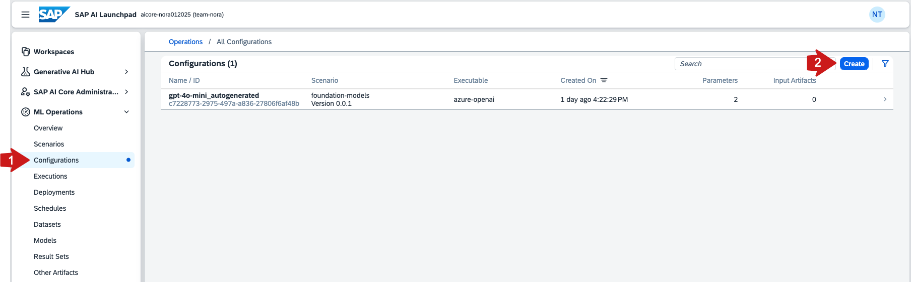
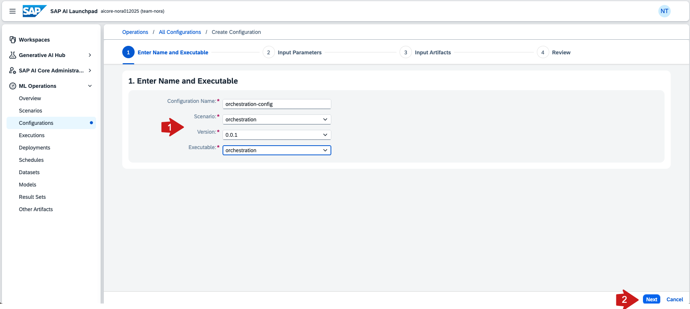
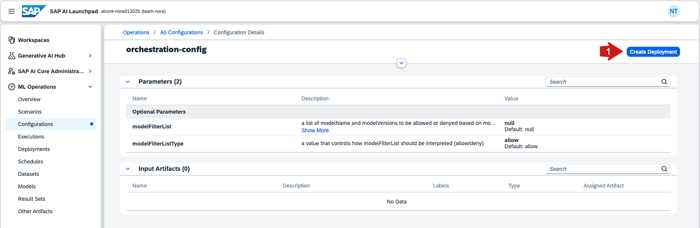
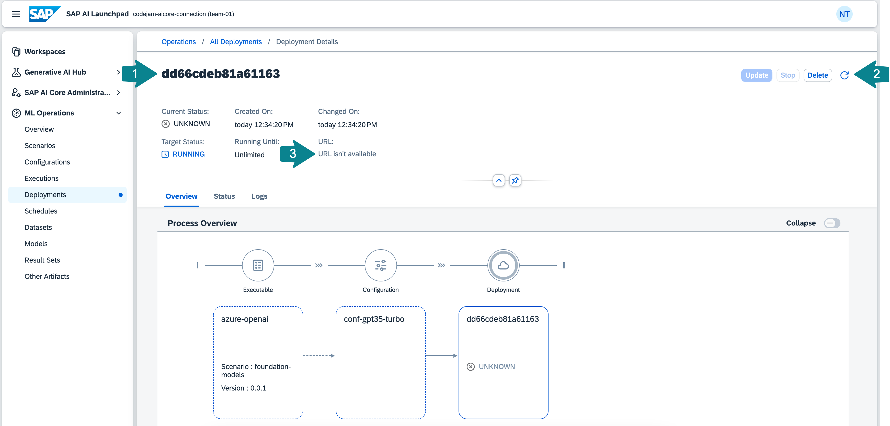
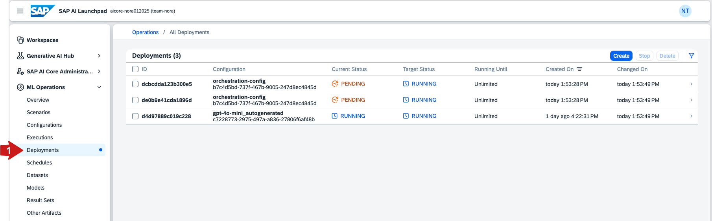

# Deploy the orchestration service SAP AI Core

To use orchestration service, you need to create a deployment [configuration](https://help.sap.com/docs/ai-launchpad/sap-ai-launchpad/configurations). Using this configuration, you can deploy the orchestration service. After successful deployment, you will receive a deployment URL, which you can use to query the model of your choice via the orchestration service.

☝️ Some of you already created an orchestration deployment in the beginning. Go to the SAP AI Launchpad and find your deployment URL under `Deployments`.

## Create a configuration to deploy the orchestration service on SAP AI Core

👉 Open the `ML Operations` tab and click on `Configurations`.

👉 **Create** a new configuration.

👉 Enter a configuration name `orchestration-conf`, select the `orchestration` scenario, version and the executable `orchestration`. 

👉 Click **Next**, **Next**, **Review** and **Create**.

## Deploy a proxy for a large language model on SAP AI Core

👉 Click on `Create Deployment` to create a deployment for that configuration. 

This will not actually deploy all the models, but it will deploy a proxy that returns a URL for you to use to query the models via the orchestration service. 

👉 Click **Review** and **Create**.

The deployment status is going to change from `UNKNOWN` to `PENDING` and then to `RUNNING`. 

Once the deployment is running you will receive a URL to query the orchestration service. Wait a couple of minutes, then use the **refresh** icon on the page for the URL to appear. 

☝️ You will need the deployment URL in the next exercise!

Under `Deployments` you can see all the deployed models and their status.

Using the `URL`, `client ID`, and `client secret` from the SAP AI Core service key, you can now query the model using any programming language or API platform.

## Summary

By this point, you will have learned which models are available through the Generative AI Hub and how to deploy the orchestration service in SAP AI Launchpad.

## Further reading

* [SAP AI Launchpad - Help Portal (Documentation)](https://help.sap.com/docs/ai-launchpad/sap-ai-launchpad/what-is-sap-ai-launchpad)
* [SAP AI Core Terminology](https://help.sap.com/docs/sap-ai-core/sap-ai-core-service-guide/terminology)
* [Available Models in the Generative AI Hub](https://me.sap.com/notes/3437766)

---

[Next exercise](08-orchestration-service.ipynb)
